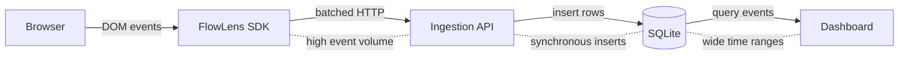

# FlowLens

FlowLens is a full-stack interaction analytics platform: a lightweight browser SDK captures user events, an ingestion API stores them, and a dashboard renders heatmaps, tag stats, and component activity over time.

## Problem & Motivation
Product teams want a fast way to understand where users click, hover, scroll, and type without adding custom analytics code to every view. FlowLens keeps the client integration minimal while still enabling meaningful visualization and exploration in a local dev or demo environment.

## Architecture Diagram


Data flow is unidirectional: browser → SDK → API → DB → dashboard. The bottlenecks to watch are client event volume, DB write throughput, and long-range query scans.

## SDK Design
- Global `FlowLensSDK.init({ siteId, serverUrl })` bootstrap; singleton to avoid duplicate listeners.
- Captures click, hover, keydown, and scroll events with viewport geometry (`x`, `y`, `w`, `h`) and optional tag name.
- Batching via `Transport`: configurable `batchIntervalMs` and `maxBatchSize` with retry-on-failure requeue.
- Throttled hover and scroll to reduce client overhead.

## Backend & Data Model
- Express API with Zod payload validation.
- `POST /api/events` accepts batched events; `GET /api/events` queries by site, path, and time window.
- `GET /api/stats/tags` aggregates counts by tag for the selected time range.
- `GET /api/stats/tags/series` returns time-bucketed counts per tag for component-level aggregation.
- SQLite schema: append-only `events` table with indexes on `(site_id, ts)` and `path`.

## Performance Characteristics
- Measured ingest (local benchmark, 50k events, batch=100): ~84,026 events/sec (~5,041,592 events/min), p50 1.0ms, p95 1.8ms.
- Average batch size in the benchmark run: 100.0 events/request.
- Client reduces network chatter through batching and throttling; server write throughput remains bound by a single process and disk I/O.
- Dashboard queries are bounded by time range; the `(site_id, ts)` index keeps recent-window scans efficient.

## Benchmarks (Local, Reproducible)
Run the ingest benchmark against a running server:
```bash
pnpm dev:server
pnpm -C packages/server benchmark -- --events 50000 --batch 100
```

What this measures:
- Events/sec and events/min ingested
- Average batch size
- p50 and p95 ingest latency per batch request

You can also sanity-check query latency by widening the time range in the dashboard after a large benchmark run.

Sample results (local run, 50k events, batch=100):
- Throughput: ~84,026 events/sec (~5,041,592 events/min)
- Avg batch size: 100.0
- Ingest latency: p50 1.0ms, p95 1.8ms
- Total time: ~0.60s

## Security & Privacy
- Current collection is structural metadata only (event type, coordinates, viewport size, tag), not DOM contents.
- CORS can be restricted via `CORS_ORIGIN` in the server env.
- No user identity or session tracking is captured by default.

Privacy design notes (explicitly documented, partially future work):
- Client-side filtering: support an allow/deny list of tags or selectors to avoid sensitive UI regions (for example, `input[type=password]`, `[data-private]`).
- Coordinate coarsening: optionally snap `x/y` to a grid before sending to reduce precision and re-identification risk.
- Retention policy: expire or downsample raw events after a defined window (for example, 7-30 days) and keep only aggregates.
- Opt-out mechanism: respect a client flag (for example, `window.FLOWLENS_DISABLED = true`) or a per-site config toggle.
- Data minimization defaults: do not capture DOM text, attribute values, or form field contents.

## Signature Feature: Time-Bucketed Component Activity
Beyond heatmaps, FlowLens aggregates events by tag and time bucket (`/api/stats/tags/series`) to show how component activity changes over time. This emphasizes data modeling tradeoffs (bucketing, top-K selection, and query efficiency) rather than only rendering points on a canvas.

## Engineering Decision: SQLite (not Postgres)
**Decision**: Use SQLite via `better-sqlite3` for ingestion and querying.

**Alternatives considered**:
- Postgres: production-ready concurrency and query flexibility, but heavier setup and operational overhead for a portfolio project.
- In-memory store (Redis): fast writes but no durable history or ad-hoc querying.

**Tradeoffs**:
- Pros: zero-config local development, fast reads for small datasets, easy seeding.
- Cons: single-writer limitations, no horizontal scaling, and limited concurrency under high ingest.

## Tradeoffs & Future Work
- Add session replay and/or DOM snapshots for richer insight beyond aggregated event signals.
- Introduce a queue or async worker to decouple ingest from storage.
- Add authentication and per-site API keys for multi-tenant usage.
- Move analytics storage to Postgres/ClickHouse for higher ingest rates.

## Lessons Learned
- SQLite is excellent for local speed, but its single-writer model becomes the bottleneck first.
- SDK batching improves throughput but creates edge cases around tab close and partial failure.
- Heatmaps trade precision for speed; time-bucketing and tag aggregation make the dashboard more interpretable.

## Setup

### Local requirements
- Node.js 20 or 22 (required for `better-sqlite3` native build).
- pnpm 9+ (workspace manager).

### 1) Clone the repository
```bash
git clone https://github.com/jennifers415/flowlens.git
cd flowlens
```

### 2) Use a supported Node version
If you use `nvm`:
```bash
nvm install 20
nvm use 20
```

### 3) Install workspace dependencies (pnpm)
```bash
pnpm install
```

### 4) Create the server env file
```bash
cp packages/server/.env.example packages/server/.env
```

### 5) Run everything (server + dashboard)
```bash
pnpm dev
```

## Demo Page (served by the dashboard dev server)
1) Build the SDK bundle into the dashboard public folder:
```bash
pnpm -C packages/sdk build:dashboard
```
2) Start the server + dashboard (if not already running):
```bash
pnpm dev
```
3) Open:
- Demo page: `http://localhost:5173/demo.html`
- Dashboard: `http://localhost:5173`

## Testing
```bash
pnpm test
```

What is tested (and why it matters):
- SDK batching/throttling behavior to guard against event spam and timing edge cases.
- API route ingest/query flows to ensure payload validation and end-to-end event integrity.

## Deployment (Docker)
Build and run both services:
```bash
docker compose up --build
```

Environment configuration:
- Server env lives in `packages/server/.env.example`.
- For Docker, adjust `CORS_ORIGIN`, `DATABASE_PATH`, and `VITE_SERVER_URL` in `docker-compose.yml`.
### Embedding SDK to additional HTML pages
First build the SDK bundle:
```bash
pnpm -C packages/sdk build
```

Then include the UMD bundle and initialize:
```html
<script src="/packages/sdk/dist/flowlens-sdk.umd.js"></script>
<script>
FlowLensSDK.init({
  siteId: 'demo',
  serverUrl: 'http://localhost:5055'
});
</script>
```

If you are serving from the dashboard dev server, copy the bundle into `public` and use `/flowlens-sdk.umd.js`:
```bash
pnpm -C packages/sdk build:dashboard
```
